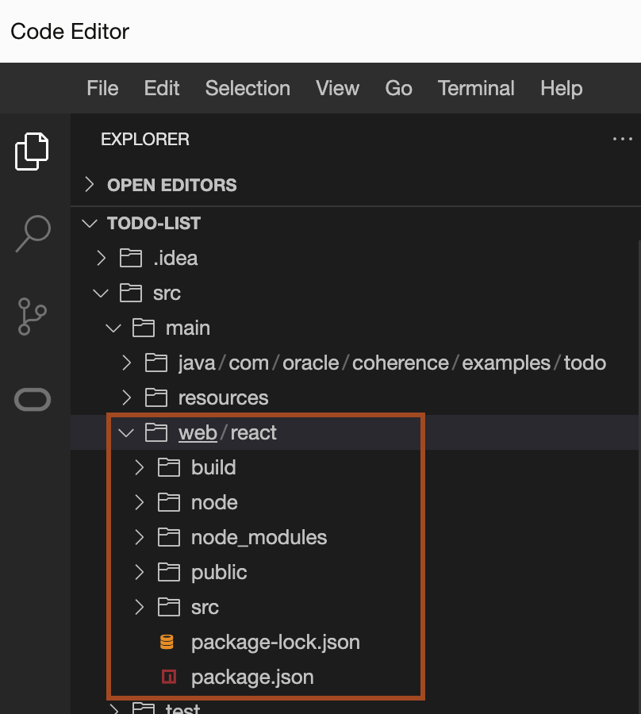
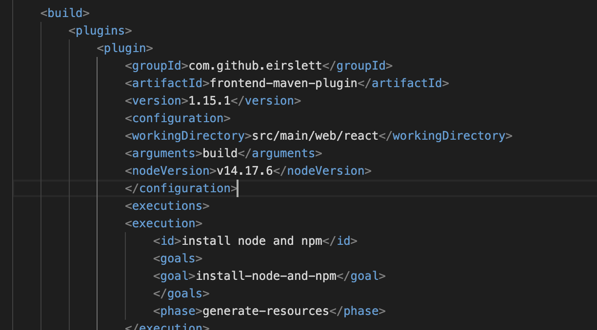
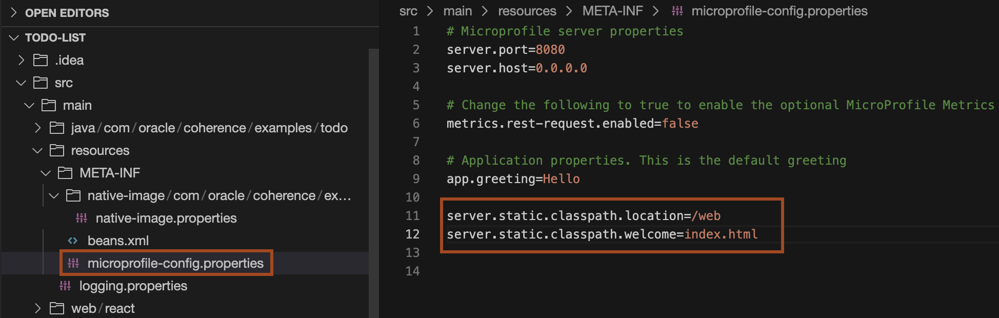
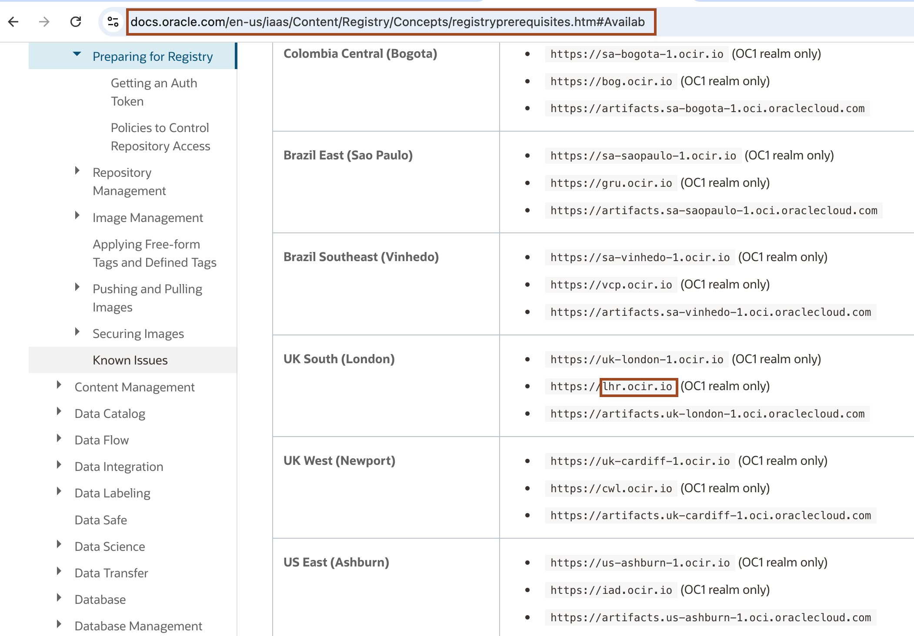
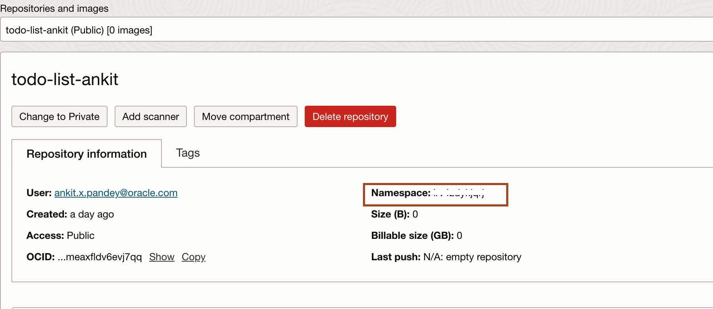
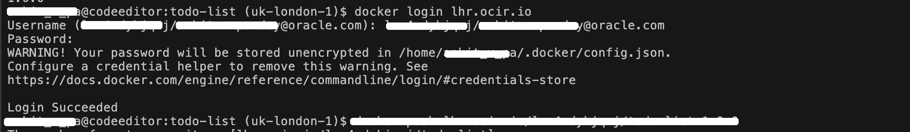

# Add react ui (frondend) code to existing todo-list application

## Introduction


### Objectives

In this lab, you will:

* 

### Prerequisites

To run this lab, you must have:
* 

## Task 1: Add React UI code to existing Todo-list application

1. In the new terminal, copy and paste the following command to copy the React UI code to the exiting **todo-list** application **src/main** folder.
    ```bash
    <copy>cd ~
    curl -O https://objectstorage.uk-london-1.oraclecloud.com/p/HKHF6BBrCZVcg6fbGkv6YjSg57t2F7jpT3TEkiaxKZwdyc62x_RVwGUe66OTyfV1/n/lrv4zdykjqrj/b/ankit-bucket/o/web.zip
    unzip web.zip
    cp -rf web todo-list/src/main/</copy>
    ```
    You will see **web** folder inside the explorer.
    


## Task 2: Changes to existing application build the application with frontend

1. Copy and paste the following command to add the required maven plugin in the **pom.xml** which will build this web component along with main Helidon application.

    ```bash
    <copy><plugin>
        <groupId>com.github.eirslett</groupId>
        <artifactId>frontend-maven-plugin</artifactId>
        <version>1.15.1</version>
        <configuration>
          <workingDirectory>src/main/web/react</workingDirectory>
          <arguments>build</arguments>
          <nodeVersion>v14.17.6</nodeVersion>
        </configuration>
        <executions>
          <execution>
            <id>install node and npm</id>
            <goals>
              <goal>install-node-and-npm</goal>
            </goals>
            <phase>generate-resources</phase>
          </execution>
          <execution>
            <id>npm install</id>
            <goals>
              <goal>npm</goal>
            </goals>
            <phase>generate-resources</phase>
            <configuration>
              <arguments>install -s</arguments>
              <npmRegistryURL>https://registry.npmjs.org</npmRegistryURL>
            </configuration>
          </execution>
          <execution>
            <id>build-frontend</id>
            <goals>
              <goal>npm</goal>
            </goals>
            <phase>generate-resources</phase>
            <configuration>
              <arguments>run build</arguments>
            </configuration>
          </execution>
        </executions>
      </plugin>
         <plugin>
            <groupId>org.apache.maven.plugins</groupId>
            <artifactId>maven-resources-plugin</artifactId>
            <version>3.3.1</version>
            <executions>
            <execution>
                <id>copy-frontend</id>
                <phase>generate-resources</phase>
                <goals>
                <goal>copy-resources</goal>
                </goals>
                <configuration>
                <outputDirectory>${project.build.directory}/classes/web</outputDirectory>
                <resources>
                    <resource>
                    <directory>${project.basedir}/src/main/web/react/build</directory>
                    <filtering>true</filtering>
                    </resource>
                </resources>
                </configuration>
            </execution>
            </executions>
        </plugin></copy>
    ```
    


2. In the **src/main/resources/META-INF/microprofile-config.properties** file, copy and paste the following:
    ```bash
    <copy>server.static.classpath.location=/web
    server.static.classpath.welcome=index.html</copy>
    ```
    


## Task 3: Create Todo-list application docker image 

1. Copy and paste the following **docker** profile in the **pom.xml**.
    ```bash
    <copy><profiles>
            <profile>
                <id>docker</id>
                    <build>
                        <plugins>
                            <plugin>
                                <groupId>com.google.cloud.tools</groupId>
                                <artifactId>jib-maven-plugin</artifactId>
                                <version>${version.plugin.jib}</version>
                                <configuration>
                                <from>
                                    <image>
                                    gcr.io/distroless/java21-debian12
                                    </image>
                                </from>
                                <to>
                                    <image>todo-list</image>
                                    <tags>
                                    <tag>${project.version}</tag>
                                    </tags>
                                </to>
                                <container>
                                    <ports>
                                    <port>8080</port>
                                    <port>7001</port>
                                    <port>9612</port>
                                    </ports>
                                    <creationTime>USE_CURRENT_TIMESTAMP</creationTime>
                                </container>
                                <containerizingMode>packaged</containerizingMode>
                                </configuration>
                                <executions>
                                <execution>
                                    <goals>
                                    <goal>dockerBuild</goal>
                                    </goals>
                                    <phase>package</phase>
                                </execution>
                                </executions>
                            </plugin>
                        </plugins>
                    </build>
            </profile>

        </profiles></copy>
    ```

2. Copy and paste the following command to create docker image of the **todo-list** application.
    ```bash
    <copy>mvn clean install
    mvn package -P docker</copy>
    ```

3. Copy and paste the following command to check the new docker image created.
    ```bash
    <copy>docker images</copy>
    ```
    
    You should see output similar to the following:
    ```bash
    $ docker images
    REPOSITORY          TAG                 IMAGE ID            CREATED             SIZE
    todo-list           1.0-SNAPSHOT        77a7844665d9        18 seconds ago      229MB
    todo-list           latest              77a7844665d9        18 seconds ago      229MB
    $
    ```

## Task 4: Tag docker image and push image to OCIR 

1. To create the docker image tag, we need the following information:

    * End point for the Region
    * Tenancy Namespace

2. Locate the **Endpoint for Your Region**. Refer to the table documented at this URL [https://docs.oracle.com/en-us/iaas/Content/Registry/Concepts/registryprerequisites.htm#Availab](https://docs.oracle.com/en-us/iaas/Content/Registry/Concepts/registryprerequisites.htm#Availab). In the example shown, the endpoint for the region is **UK South (London)** (as the region name) and its endpoint is **lhr.ocir.io**. Locate the endpoint for your own **Region Name** and note it down.

    

3. In the lab 1, you already noted the tenancy namespace. If not, then for finding the Namespace of the tenancy, select the **Hamburger Menu** -> **Developer Services** -> **Container Registry**. Select the repository you created, you will find the Namespace as shown.
    

4. Now you have both the Tenancy Namespace and Endpoint for your region. Copy the following command and paste it in your text file. Then replace the **`END_POINT_OF_YOUR_REGION`** with the endpoint of your region name, **`NAMESPACE_OF_YOUR_TENANCY`** with your tenancy's namespace.
    

    ````bash
    <copy>docker image tag todo-list:1.0-SNAPSHOT END_POINT_OF_YOUR_REGION/NAMESPACE_OF_YOUR_TENANCY/todo-list-your_first_name:1.0.0</copy>
    ````
    > For example, in my case command  is `docker image tag todo-list:1.0-SNAPSHOT lhr.ocir.io/tenancynamespace/todo-list-ankit:1.0.0`.

5. To push this docker image to OCIR, You need to login to your region. For that you need the username and password.
    Your username follows the pattern: **`NAMESPACE_OF_YOUR_TENANCY`/`YOUR_ORACLE_CLOUD_USERNAME`**. <br>
    * Replace **`NAMESPACE_OF_YOUR_TENANCY`** with your tenancy's namespace
    * Replace **`YOUR_ORACLE_CLOUD_USERNAME`** with your Oracle Cloud Account user name
    > For example, in my case **OCIR Username** is `tenancynamespace/lab.user@oracle.com`.


6.  For Password, You need to use authentication token which you copied in lab 1.
    
7. Copy and paste the following command to login to you OCIR.
    ```bash
    <copy>docker login REGION_ENDPOINT</copy>
    ```
    > Then you need to enter the username and password as described above.
    


8. Copy and paste the following command to push your docker image to OCIR.
    ```bash
    <copy>docker push END_POINT_OF_YOUR_REGION/NAMESPACE_OF_YOUR_TENANCY/todo-list-your_first_name:1.0.0</copy>
    ```
    > For example, in my case command  is `docker push lhr.ocir.io/tenancynamespace/todo-list-ankit:1.0.0`.


## Acknowledgements

* **Author** -  Ankit Pandey
* **Contributors** - Maciej Gruszka, Sid Joshi
* **Last Updated By/Date** - Ankit Pandey, February 2024