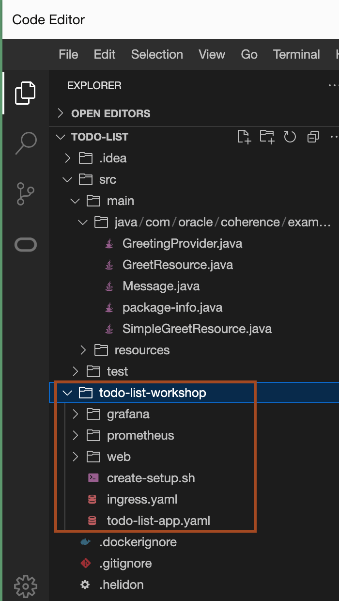

# Create a Helidon porject and open it in OCI Code Editor

## Introduction


### Objectives

In this lab, you will:

* 

## Task 1: Generate Helidon project using Maven  

1. In the OCI Console, Click **Developer tools** and then click **Code Editor**. 

2. In Code Editor, Click **Terminal** -> **New Terminal**.
    

3. Copy and paste the following command to create a Helidon project **todo-list** in the  terminal.
    ```bash
    <copy>mvn -U archetype:generate -DinteractiveMode=false \
    -DarchetypeGroupId=io.helidon.archetypes \
    -DarchetypeArtifactId=helidon-quickstart-mp \
    -DarchetypeVersion=4.1.6 \
    -DgroupId=com.oracle.coherence.examples \
    -DartifactId=todo-list \
    -Dpackage=com.oracle.coherence.examples.todo</copy>
    ```
    


## Task 2: Open Todo list project in OCI Code Editor

1. To open the **todo-list** project in the code editor, click **File** -> **Open**.
    

2. Select **todo-list** and click **Open**.
    


## Task 3: Setup Maven and JDK in the terminal

1. Copy and paste the following command in the terminal to download the required jdk and maven and setup the **PATH** and **`JAVA_HOME`** environment variables.
    ```bash
    <copy>cd ~
    wget https://dlcdn.apache.org/maven/maven-3/3.8.8/binaries/apache-maven-3.8.8-bin.tar.gz
    tar -xzvf apache-maven-3.8.8-bin.tar.gz
    wget https://download.oracle.com/java/21/archive/jdk-21.0.4_linux-x64_bin.tar.gz
    tar -xzvf jdk-21.0.4_linux-x64_bin.tar.gz
    JAVA_HOME=~/jdk-21.0.4
    PATH=~/apache-maven-3.8.8/bin:~/jdk-21.0.4/bin:$PATH
    cd todo-list</copy>
    ```

2. Copy and paste the following command to check the maven and jdk versions.
    ```bash
    <copy>mvn -v</copy>
    ```

    You should have output similar to the following:
    ```bash
    $ mvn -v 
    Apache Maven 3.8.8 (4c87b05d9aedce574290d1acc98575ed5eb6cd39)
    Maven home: /home/ankit_x_pa/apache-maven-3.8.8
    Java version: 21.0.4, vendor: Oracle Corporation, runtime: /home/ankit_x_pa/jdk-21.0.4
    Default locale: en_US, platform encoding: UTF-8
    OS name: "linux", version: "4.14.35-2047.542.2.el7uek.x86_64", arch: "amd64", family: "unix"
    $
    ```


## Task 4: Download workshop files 

1. Copy and paste the following commands to download the required files for the workshop.
    ```bash
    <copy>curl -O https://objectstorage.uk-london-1.oraclecloud.com/p/pKeTb8V9V6O3-lFip5BD97kVoeQ6OOmgq1z8n485WxnXWojT8PBATYWPLp3fWOsS/n/lrv4zdykjqrj/b/ankit-bucket/o/todo-list-workshop.zip
    unzip todo-list-workshop.zip</copy>
    ```

2. Check the explorer, to verify that **todo-list-workshop** folder is available inside the **todo-list** folder.
    

    
You may now proceed to the next lab.

## Acknowledgements

* **Author** -  Ankit Pandey
* **Contributors** - Maciej Gruszka, Sid Joshi
* **Last Updated By/Date** - Ankit Pandey, February 2024