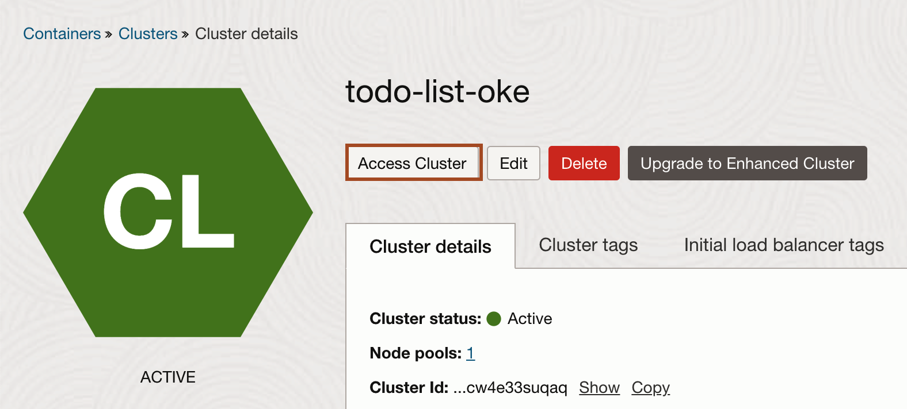
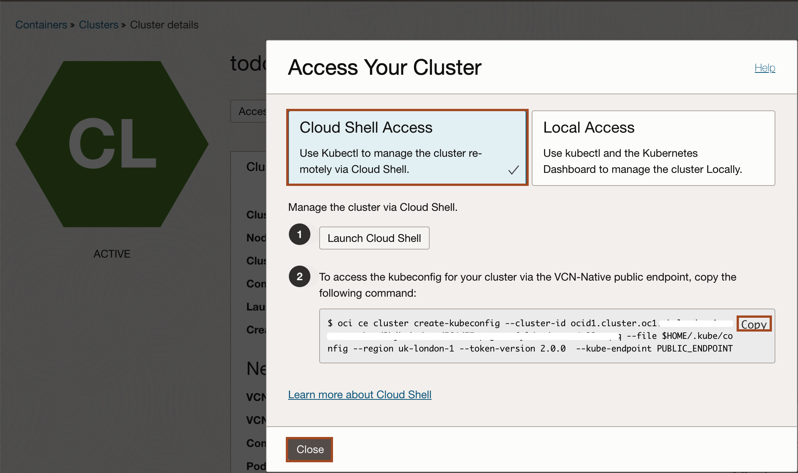
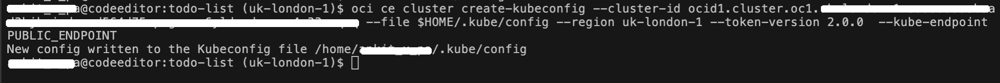
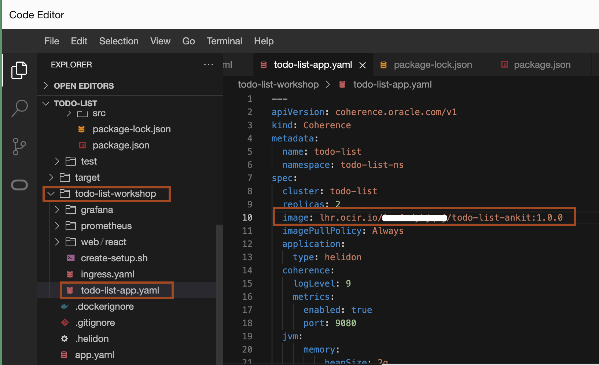
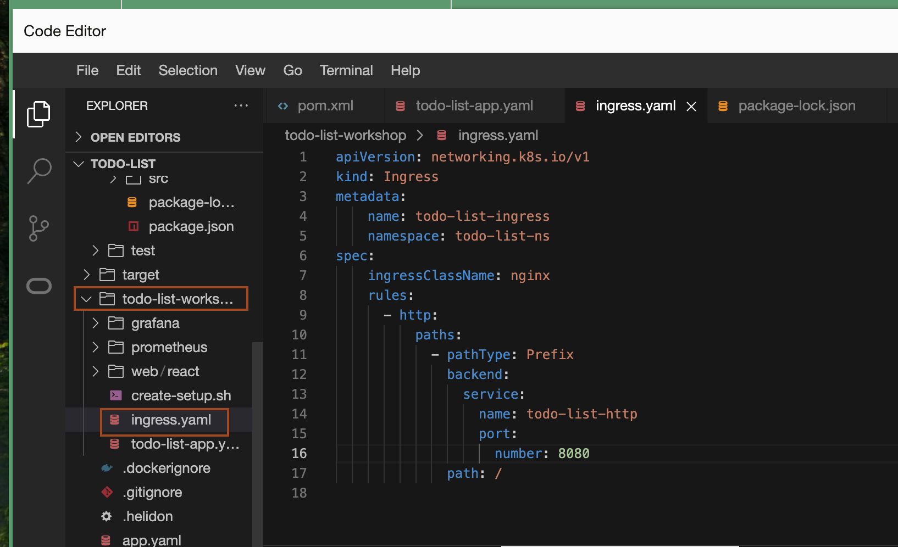
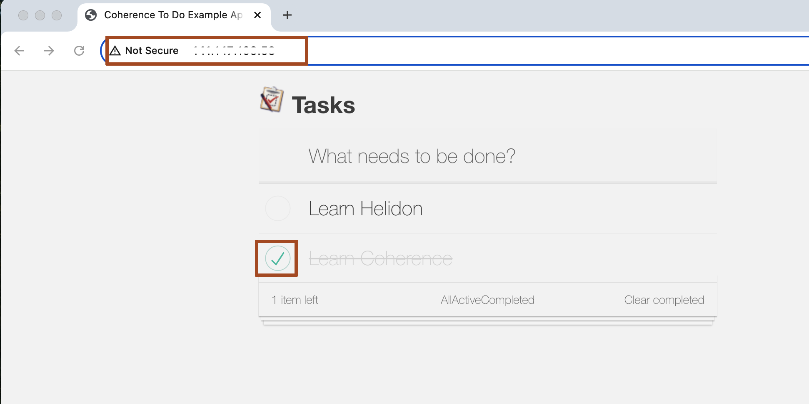

# Deploy Todo-list application to OKE

## Introduction


### Objectives

In this lab, you will:

* 

## Task 1: Connect to OKE from the OCI Code Editor terminal

1. Click [http://cloud.oracle.com](http://cloud.oracle.com) to open a new tab in the broswer. Click **Hamburger menu** -> **Developer Services** -> **Kubernetes Cluster** and then click the OKE cluster which you created in lab 1.

2. Click **Access Cluster** and then select **Cloud Shell Access**, Click **Copy** to copy the command. Click **Close**.

    
    

3. Go back to Code Editor, paste the copied command in the terminal. It will create the **~/.kube/config** file, which allows you to access your kubernetes cluster from the terminal in the Code Editor.
    


## Task 2: Deploy Coherence Operator, Nginx, Prometheus and Grafana to OKE 


1. Copy and paste the following command to install **coherence operator**, **nginx controller**, **prometheus** and **grafana** to Oracle Kubernetes Cluster(OKE).
    ```bash
    <copy>cd ~/todo-list/todo-list-workshop
    ./create-setup.sh</copy>
    ```

2. Copy and paste the following command to know, what resources are created and in which namespace.
    ```bash
    <copy>kubectl get all -n ingress-ns
    kubectl get all -n coherence
    kubectl get all -n monitoring</copy>
    ```
    
    > Make sure, you have all the pods in the above namespace in running state.
    

## Task 3: Deploy Todo-list application to OKE

1. In the Code Editor, Click **todo-list-app.yaml** file to open it and Modify the image tag value with the image tag, that you created in lab 4. 
    
    > Your image tag contain, your region endpoint, your tenancy name and your's registry name. Above screenshot is just for example.

2. Copy and paste the following command to deploy the **todo-list** application to Oracle Kubernetes cluster(OKE).
    ```bash
    <copy>cd ~/todo-list/todo-list-workshop/
    kubectl apply -f todo-list-app.yaml</copy>
    ```

3. Copy and paste the following command to know the pods status. Re-run the commands untill you see both pods are in the **Running Status**.
    ```bash
    <copy>kubectl get pods -n todo-list-ns</copy>
    ```


## Task 4: Access Todo-list application 

1. We have created ingress route definition for the application, open **ingress.yaml** file from **todo-list-workshop** folder as shown below.
    

2. Copy and paste the following command to deploy this ingress route in the **todo-list-ns** namespace, where application has been deployed.
    ```bash
    <copy>kubectl apply -f todo-list-workshop/ingress.yaml</copy>
    ```

3. To know the load balancer public ip, run the following command.
    ```bash
    <copy>kubectl get svc -n ingress-ns| awk -v OFS='\t\t' '{print $4}'</copy>
    ```

4. Open this public ip as **`http://PUBLIC_IP/`** to access the application as shown below.
    Enter few task and make some task completed, you will have output as shown below.
    


You may now proceed to the next lab.

## Acknowledgements

* **Author** -  Ankit Pandey
* **Contributors** - Maciej Gruszka, Sid Joshi
* **Last Updated By/Date** - Ankit Pandey, February 2024