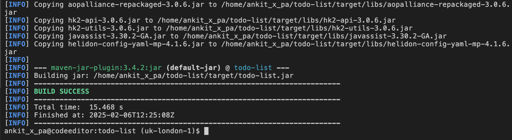

# Develop Backend for the todo0list application


## Introduction


### Objectives

In this lab, you will:

* Install Ingress Controller on Kubernetes Cluster.
* Update the Ingress Routes.


## Task 1: Develop backend for the todo-list application

1. Open **pom.xml** file and add the following properties before dependecies as shown below.
    ```bash
    <copy><properties>
        <version.lib.coherence>24.09</version.lib.coherence>
        <version.plugin.jib>3.4.4</version.plugin.jib>
        <version.plugin.failsafe>3.2.5</version.plugin.failsafe>
        <version.plugin.jar>3.4.2</version.plugin.jar>
    </properties></copy>
    ```
    

2. In **pom.xml**, add the following for **coherence dependency management**. 
    ```bash
    <copy><dependencyManagement>
        <dependencies>
            <dependency>
                <groupId>com.oracle.coherence.ce</groupId>
                <artifactId>coherence-bom</artifactId>
                <version>${version.lib.coherence}</version>
                <type>pom</type>
                <scope>import</scope>
            </dependency>
        </dependencies>
    </dependencyManagement></copy>
    ```
    

3. In **pom.xml**, add the following **coherence dependencies**.
    ```bash
    <copy><dependency>
        <groupId>com.oracle.coherence.ce</groupId>
        <artifactId>coherence-cdi-server</artifactId>
    </dependency>
    <dependency>
        <groupId>com.oracle.coherence.ce</groupId>
        <artifactId>coherence-mp-config</artifactId>
        <scope>runtime</scope>
    </dependency></copy>
    ```
    


4. In **pom.xml**, add the following dependency for Server side events supports.
    ```bash
    <copy><dependency>
        <groupId>org.glassfish.jersey.media</groupId>
        <artifactId>jersey-media-sse</artifactId>
    </dependency></copy>
    ```
    

5. To create **Task.java**, right click on *java/com/oracle/coherence/example/todo* and select **New File** and name it **Task.java** then click **OK**.
    

6. Copy and paste the following code in the **Task.java**.
    ```bash
    <copy>/*
 * Copyright (c) 2020, 2021, Oracle and/or its affiliates.
 *
 * Licensed under the Universal Permissive License v 1.0 as shown at
 * https://oss.oracle.com/licenses/upl.
 */

package com.oracle.coherence.examples.todo;

import com.oracle.coherence.repository.Indexed;

import com.tangosol.io.pof.schema.annotation.Portable;
import com.tangosol.io.pof.schema.annotation.PortableType;

import java.time.Instant;
import java.time.LocalDateTime;
import java.time.ZoneId;

import java.util.Objects;
import java.util.UUID;
import java.io.Serializable;


@PortableType(id = 1000)
public class Task implements Serializable 
    {
    // ---- data members ----------------------------------------------------

    /**
     * The creation time.
     */
    @Portable
    private long createdAt;

    /**
     * The completion status.
     */
    @Portable
    private Boolean completed;

    /**
     * The task ID.
     */
    @Portable
    private String id;

    /**
     * The task description.
     */
    @Portable
    private String description;

    // ---- constructors ----------------------------------------------------

    /**
     * Deserialization constructor.
     */
    public Task()
        {
        }

    /**
     * Construct {@link Task} instance.
     *
     * @param description  task description
     */
    public Task(String description)
        {
        this.id = UUID.randomUUID().toString().substring(0, 6);
        this.createdAt = System.currentTimeMillis();
        this.description = description;
        this.completed = false;
        }

    // ---- accessors -------------------------------------------------------

    /**
     * Get the creation time.
     *
     * @return the creation time
     */
    public long getCreatedAt()
        {
        return createdAt;
        }

    /**
     * Get the task ID.
     *
     * @return the task ID
     */
    public String getId()
        {
        return id;
        }

    /**
     * Get the task description.
     *
     * @return the task description
     */
    public String getDescription()
        {
        return description;
        }

    /**
     * Set the task description.
     *
     * @param description  the task description
     *
     * @return this task
     */
    public Task setDescription(String description)
        {
        this.description = description;
        return this;
        }

    /**
     * Get the completion status.
     *
     * @return true if it is completed, false otherwise.
     */
    @Indexed
    public Boolean getCompleted()
        {
        return completed;
        }

    /**
     * Sets the completion status.
     *
     * @param completed  the completion status
     *
     * @return this task
     */
    public Task setCompleted(Boolean completed)
        {
        this.completed = completed;
        return this;
        }

    /**
     * Returns the created date as a {@link LocalDateTime}.
     *
     * @return the created date as a {@link LocalDateTime}.
     */
    public LocalDateTime getCreatedAtDate()
        {
        return LocalDateTime.ofInstant(Instant.ofEpochMilli(createdAt), ZoneId.systemDefault());
        }

    // ---- Object methods --------------------------------------------------

    @Override
    public boolean equals(Object o)
        {
        if (this == o)
            {
            return true;
            }
        if (o == null || getClass() != o.getClass())
            {
            return false;
            }
        Task task = (Task) o;
        return createdAt == task.createdAt &&
               Objects.equals(completed, task.completed) &&
               id.equals(task.id) &&
               description.equals(task.description);
        }

    @Override
    public int hashCode()
        {
        return Objects.hash(createdAt, completed, id, description);
        }

    @Override
    public String toString()
        {
        return "Task{"
               + "id=" + id
               + ", description=" + description
               + ", completed=" + completed
               + ", createdAt=" + getCreatedAtDate()
               + '}';
        }
    }</copy>
    ```

7. Similarly create **TaskRepository.java** and then copy/paste the following content in the file.
    ```bash
    <copy>package com.oracle.coherence.examples.todo;

import com.oracle.coherence.repository.AbstractRepository;

import com.tangosol.net.NamedMap;

import jakarta.enterprise.context.ApplicationScoped;

import jakarta.inject.Inject;


@ApplicationScoped
public class TaskRepository extends AbstractRepository<String, Task>
    {
    @Inject
    private NamedMap<String, Task> tasks;

    protected NamedMap<String, Task> getMap()
        {
        return tasks;
        }

    protected String getId(Task task)
        {
        return task.getId();
        }

    protected Class<? extends Task> getEntityType()
        {
        return Task.class;
        }
    }</copy>
    ```

8. Similarly create **ToDoListService.java** and then copy/paste the following content in the file.
    ```bash
    <copy>/*
 * Copyright (c) 2021, Oracle and/or its affiliates.
 *
 * Licensed under the Universal Permissive License v 1.0 as shown at
 * https://oss.oracle.com/licenses/upl.
 */

package com.oracle.coherence.examples.todo;

import com.tangosol.util.Filter;

import java.util.Collection;
import java.util.Objects;

import java.util.Optional;

import jakarta.enterprise.context.ApplicationScoped;
import jakarta.inject.Inject;

import jakarta.ws.rs.NotFoundException;

import static com.tangosol.util.Filters.always;
import static com.tangosol.util.Filters.equal;
import static com.tangosol.util.Filters.isTrue;

/**
 * To Do List API implementation that can be used by all API facades.
 *
 * @author Aleks Seovic
 */
@ApplicationScoped
public class ToDoListService
    {
    //----- constants -------------------------------------------------------

    private static final String MESSAGE = "Unable to find task with id ";

    //----- data members ----------------------------------------------------

    @Inject
    protected TaskRepository tasks;

    //----- ToDoListApi methods ---------------------------------------------

    /**
     * Create a {@link Task}.
     *
     * @param description task description
     *
     * @return the created {@link Task}
     */
    public Task createTask(String description)
        {
        Objects.requireNonNull(description, "description is required");
        return tasks.save(new Task(description));
        }

    /**
     * Query {@link Task}s.
     *
     * @param completed optionally specify completion status
     *
     * @return a {@link Collection} of {@link Task}s
     */
    public Collection<Task> getTasks(Boolean completed)
        {
        Filter<Task> filter = completed == null
                              ? always()
                              : equal(Task::getCompleted, completed);

        return tasks.getAllOrderedBy(filter, Task::getCreatedAt);
        }

    /**
     * Find a {@link Task}.
     *
     * @param id task id
     *
     * @return the {@link Task} with the given id
     *
     * @throws NotFoundException if the task was not found
     */
    public Task findTask(String id)
        {
        return Optional
                .ofNullable(tasks.get(id))
                .orElseThrow(() -> new NotFoundException(MESSAGE + id));
        }

    /**
     * Delete a {@link Task}.
     *
     * @param id task to delete
     *
     * @return the deleted {@link Task}
     *
     * @throws NotFoundException if the task was not found
     */
    public Task deleteTask(String id)
        {
        return Optional
                .ofNullable(tasks.removeById(id, true))
                .orElseThrow(() -> new NotFoundException(MESSAGE + id));
        }

    /**
     * Remove all completed {@link Task}s.
     *
     * @return whether any tasks have been removed
     */
    public boolean deleteCompletedTasks()
        {
        return tasks.removeAll(isTrue(Task::getCompleted));
        }

    /**
     * Update a {@link Task} description.
     *
     * @param id           task to update
     * @param description  new description
     *
     * @return the updated {@link Task}
     *
     * @throws NotFoundException if the task was not found
     */
    public Task updateDescription(String id, String description)
        {
        return Optional
                .ofNullable(tasks.update(id, Task::setDescription, description))
                .orElseThrow(() -> new NotFoundException(MESSAGE + id));
        }

    /**
     * Update a {@link Task} completion status.
     *
     * @param id         task to update
     * @param completed  new completion status
     *
     * @return the updated {@link Task}
     *
     * @throws NotFoundException if the task was not found
     */
    public Task updateCompletionStatus(String id, boolean completed)
        {
        return Optional
                .ofNullable(tasks.update(id, Task::setCompleted, completed))
                .orElseThrow(() -> new NotFoundException(MESSAGE + id));
        }
    }</copy>
    ```

9. Similarly create **ToDoListRestApi.java** and then copy/paste the following content in the file.
    ```bash
    <copy>/*
 * Copyright (c) 2020, 2024, Oracle and/or its affiliates.
 *
 * Licensed under the Universal Permissive License v 1.0 as shown at
 * https://oss.oracle.com/licenses/upl.
 */

package com.oracle.coherence.examples.todo;

import com.oracle.coherence.examples.todo.Task;
import com.oracle.coherence.examples.todo.TaskRepository;
import com.oracle.coherence.examples.todo.ToDoListService;
import com.tangosol.net.Cluster;
import com.tangosol.net.Member;

import java.util.Collection;

import jakarta.annotation.PostConstruct;

import jakarta.enterprise.context.ApplicationScoped;

import jakarta.inject.Inject;
import jakarta.json.JsonObject;

import jakarta.ws.rs.Consumes;
import jakarta.ws.rs.DELETE;
import jakarta.ws.rs.GET;
import jakarta.ws.rs.POST;
import jakarta.ws.rs.PUT;
import jakarta.ws.rs.Path;
import jakarta.ws.rs.PathParam;
import jakarta.ws.rs.Produces;
import jakarta.ws.rs.QueryParam;
import jakarta.ws.rs.core.Context;
import jakarta.ws.rs.core.MediaType;
import jakarta.ws.rs.sse.OutboundSseEvent;
import jakarta.ws.rs.sse.Sse;
import jakarta.ws.rs.sse.SseBroadcaster;
import jakarta.ws.rs.sse.SseEventSink;

import static jakarta.ws.rs.core.MediaType.APPLICATION_JSON;
import static jakarta.ws.rs.core.MediaType.APPLICATION_JSON_TYPE;

/**
 * REST facade for To Do list API.
 */
@Path("/api/tasks")
@ApplicationScoped
public class ToDoListRestApi
    {
    @Inject
    private ToDoListService api;

    @Inject
    private TaskRepository tasks;

    @Inject
    private Cluster cluster;

    @Context
    private Sse sse;
    private SseBroadcaster broadcaster;

    @PostConstruct
    void createBroadcaster()
        {
        this.broadcaster = sse.newBroadcaster();

        tasks.addListener(
                tasks.listener()
                     .onInsert(task -> broadcaster.broadcast(createEvent("insert", task)))
                     .onUpdate(task -> broadcaster.broadcast(createEvent("update", task)))
                     .onRemove(task -> broadcaster.broadcast(createEvent("delete", task)))
                     .build());
        }

    private OutboundSseEvent createEvent(String name, Task task)
        {
        return sse.newEventBuilder()
                    .name(name)
                    .data(Task.class, task)
                    .mediaType(APPLICATION_JSON_TYPE)
                    .build();
        }

    @GET
    @Path("events")
    @Produces(MediaType.SERVER_SENT_EVENTS)
    public void registerEventListener(@Context SseEventSink eventSink)
        {
        broadcaster.register(eventSink);

        Member member = cluster.getLocalMember();
        eventSink.send(sse.newEvent("begin", member.toString()));
        }

    @POST
    @Consumes(APPLICATION_JSON)
    public Task createTask(JsonObject task)
        {
        return api.createTask(task.getString("description"));
        }

    @GET
    @Produces(APPLICATION_JSON)
    public Collection<Task> getTasks(@QueryParam("completed") Boolean completed)
        {
        return api.getTasks(completed);
        }

    @DELETE
    @Path("{id}")
    public Task deleteTask(@PathParam("id") String id)
        {
        return api.deleteTask(id);
        }

    @DELETE
    public boolean deleteCompletedTasks()
        {
        return api.deleteCompletedTasks();
        }

    @PUT
    @Path("{id}")
    @Consumes(APPLICATION_JSON)
    public Task updateTask(@PathParam("id") String id, JsonObject task)
        {
        if (task.containsKey("description"))
            {
            return api.updateDescription(id, task.getString("description"));
            }
        else if (task.containsKey("completed"))
            {
            return api.updateCompletionStatus(id, task.getBoolean("completed"));
            }

        throw new IllegalArgumentException("either description or completion status must be specified");
        }
    }</copy>
    ```

10. In the terminal, where you have set the jdk and maven, copy and paste the following command. 
    ```bash
    <copy>export COHERENCE_WKA=127.0.0.1</copy>
    ```
    


## Task 2: Build and test the todo-list application

1. Copy and paste the following commands to build the **todo-list** application.
    ```bash
    <copy>mvn clean package</copy>
    ```
    
    

2. Copy and paste the following command in the same terminal to run the application.
    ```bash
    <copy>java -jar target/todo-list.jar</copy>
    ```
    You should see the output similar to the following in the last
    ```bash
    2025.02.06 12:36:32 INFO io.helidon.cors.CorsSupportHelper Thread[#1,main,5,main]: CorsSupportHelper configured as: CorsSupportHelper{name='openapi', isActive=true, crossOriginConfigs=Aggregator{crossOriginConfigMatchables=[FixedCrossOriginConfigMatchable{matcher=pattern: (.+), crossOriginConfig=CrossOriginConfig{pathPattern={+}, enabled=true, origins=[*], allowHeaders=[*], exposeHeaders=null, allowMethods=[GET, HEAD, OPTIONS], allowCredentials=false, maxAgeSeconds=3600}], isActive=true}, secondaryCrossOriginLookup=(not set)}
    2025.02.06 12:36:32 INFO io.helidon.webserver.ServerListener VirtualThread[#82,start @default (/0.0.0.0:8080)]/runnable@ForkJoinPool-1-worker-2: [0x4f98f36f] http://0.0.0.0:8080 bound for socket '@default'
    2025.02.06 12:36:32 INFO io.helidon.webserver.LoomServer Thread[#1,main,5,main]: Started all channels in 5 milliseconds. 7857 milliseconds since JVM startup. Java 21.0.4+8-LTS-274
    2025.02.06 12:36:32 INFO io.helidon.microprofile.server.ServerCdiExtension Thread[#1,main,5,main]: Server started on http://localhost:8080 (and all other host addresses) in 7863 milliseconds (since JVM startup).
    2025.02.06 12:36:32 INFO io.helidon.common.features.HelidonFeatures Thread[#83,features-thread,5,main]: Helidon MP 4.1.6 features: [CDI, Config, Health, Metrics, Open API]
    ```

3. Open a new terminal, click **Terminal** -> **New Termial** and copy and paste the following commands to test the application.
    

    ```bash
    <copy>curl -i -X POST -H "Content-Type: application/json" -d '{"description": "Learn Coherence"}'  http://localhost:8080/api/tasks</copy>
    ```

    You should have output similar to the following:
    ```bash
    $ curl -i -X POST -H "Content-Type: application/json" -d '{"description": "Learn Coherence"}'  http://localhost:8080/api/tasks
    HTTP/1.1 200 OK
    Date: Thu, 6 Feb 2025 12:41:15 GMT
    Connection: keep-alive
    Content-Length: 133
    Content-Type: application/json

    {"completed":false,"createdAt":1738845675843,"createdAtDate":"2025-02-06T12:41:15.843","description":"Learn Coherence","id":"9fd412"}$
    ```

    ```bash
    <copy>curl -i -X GET -H "Accept: application/json"  http://localhost:8080/api/tasks</copy>
    ```

     You should have output similar to the following:
    
    ```bash
    $ curl -i -X GET -H "Accept: application/json"  http://localhost:8080/api/tasks
    HTTP/1.1 200 OK
    Date: Thu, 6 Feb 2025 12:43:21 GMT
    Connection: keep-alive
    Content-Length: 135
    Content-Type: application/json

    [{"completed":false,"createdAt":1738845675843,"createdAtDate":"2025-02-06T12:41:15.843","description":"Learn Coherence","id":"9fd412"}]$
     ```

    To update an existing task, using task id, you can use the below commands and replace task id as shown below

    ```bash
    <copy>curl -i -X PUT -H "Content-Type: application/json"  -d '{"completed": true}' http://localhost:8080/api/tasks/9fd412</copy>
    ```

    You should have output similar to the following:

    ```bash
    $ curl -i -X PUT -H "Content-Type: application/json"  -d '{"completed": true}' http://localhost:8080/api/tasks/9fd412
    HTTP/1.1 200 OK
    Date: Thu, 6 Feb 2025 12:47:10 GMT
    Connection: keep-alive
    Content-Length: 132
    Content-Type: application/json

    {"completed":true,"createdAt":1738845675843,"createdAtDate":"2025-02-06T12:41:15.843","description":"Learn Coherence","id":"9fd412"}$
    ```

## Acknowledgements

* **Author** -  Ankit Pandey
* **Contributors** - Maciej Gruszka, Sid Joshi
* **Last Updated By/Date** - Ankit Pandey, February 2024