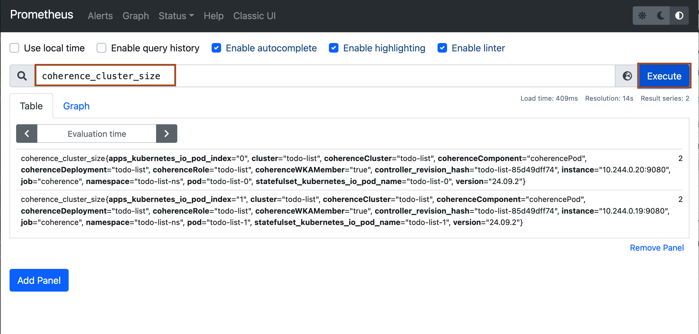

# Monitor Todo-list application with Grafana and Prometheus

## Introduction


Estimated Time: 15 minutes

### Objectives

In this lab, you will:

* 

### Prerequisites
This lab assumes you have:

* 

## Task 1: Access Coherence Metrics in Prometheus console

1. To know the public ip of the worker node, run the following command.
    ```bash
    <copy>kubectl get nodes -o wide | awk -v OFS='\t\t' '{print $7}'</copy>
    ```

2. To open prometheus console in the browser, copy the following URL and replace **`PUBLIC_IP_NODE`** with public ip of your worker node and paste the URL in the browser.
    ```bash
    <copy>http://PUBLIC_IP_NODE:30000</copy>
    ```
    

3. Type **coherence** and you will see multiple metrics, which provide coherence related information, select any one and click **Execute**.
    
    


## Task 2: Add Prometheus datasource in Grafana console 

1. To open the granfana console in the browser, copy he following URL and replace **`PUBLIC_IP_NODE`** with public ip of your worker node and paste the URL in the browser.
    ```bash
    <copy>http://PUBLIC_IP_NODE:31000</copy>
    ```
    

2. Enter **admin**/**12345678** as *username*/*password*, then click **Log in**.
    

3. In Home page, click **Add your first data source** as shown below.
    

4. Click **Prometheus**, and enter the following and click **Save and test**.
        **Name**:     prometheus</br>
        **URL**:      http://prometheus-server:80</br>
    ```bash
    <copy> http://prometheus-server:80</copy>
    ```
    
    


## Task 3: Download Coherence Dashboard and import dashboard in Grafana


1. To download the Coherence grafana dashboard, copy and paste the following URL in the browser.
    ```bash
    <copy>https://oracle.github.io/coherence-operator/dashboards/latest/coherence-dashboards.tar.gz</copy>
    ```

2. Untar the **tar.gz** file and navigate to **dashboards/grafana** folder. You will see many coherence related dashboards. Here, you will just import **coherence-dashboard-main** in the grafana. In similar way, you can import other dashboards as well.


3. To import the Coherence dashboard, click **Home** icon -> **Dashboard** icon -> **Import** as shown.
    

4. Click **Upload Json file**, and open **coherence-dashboard-main** from **dashboards/grafana** folder then click **Import**.
    
    

5. You will see the Coherence related data for the **todo-list** application as shown below.
    


Congratulation! you have successfully completed the workshop.

## Acknowledgements

* **Author** -  Ankit Pandey
* **Contributors** - Maciej Gruszka, Sid Joshi
* **Last Updated By/Date** - Ankit Pandey, February 2024