# Prepare Setup

## Introduction
This lab will show you how to download the Oracle Resource Manager (ORM) stack zip file needed to setup the resource needed to run this workshop. Then you creates a compute instance and a Virtual Cloud Network (VCN) which provides you access to a remote desktop.

Estimated Time: 10 minutes

### Objectives
* Download ORM stack
* Create Compute + Networking using Resource Manager Stack

### Prerequisites
This lab assumes you have:
- An Oracle Free Tier or Paid Cloud account

## Task 1: Download Oracle Resource Manager (ORM) stack zip file

1.  Click on the link below to download the Resource Manager zip file you need to build your environment:

    *Note 1:* If providing a single Stack download for the workshop, use this simple expression.

    - [todo-list-oke.zip](https://objectstorage.uk-london-1.oraclecloud.com/p/nJPUQJMvZcP76sLFfG65y_FNuMawxAc7V0J0DfgT-r_X5cMlt0HpZVGL8lmMFGnf/n/lrv4zdykjqrj/b/ankit-bucket/o/todo-list-oke.zip)

2.  Save in your downloads folder.

## Task 2: Create Stack: OKE 

1. Identify the ORM stack zip file downloaded in **Task 1: Download Oracle Resource Manager (ORM) stack zip file**.

2. Open up the hamburger menu in the top left corner. Click **Developer Services**, and choose **Resource Manager** > **Stacks**. Choose the compartment in which you would like to install the stack. Click **Create Stack**.
    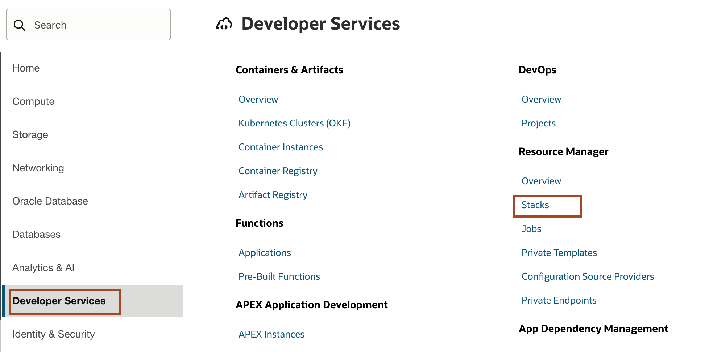
    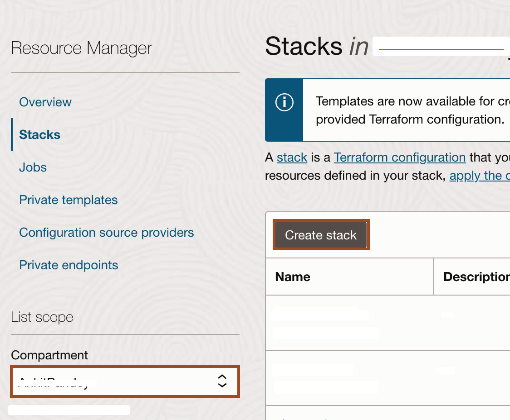

3. Select **My Configuration**, choose the **.Zip** file button, click the **Browse** link, and select the zip file that you downloaded or drag-n-drop for the file explorer. Click **Next**.
    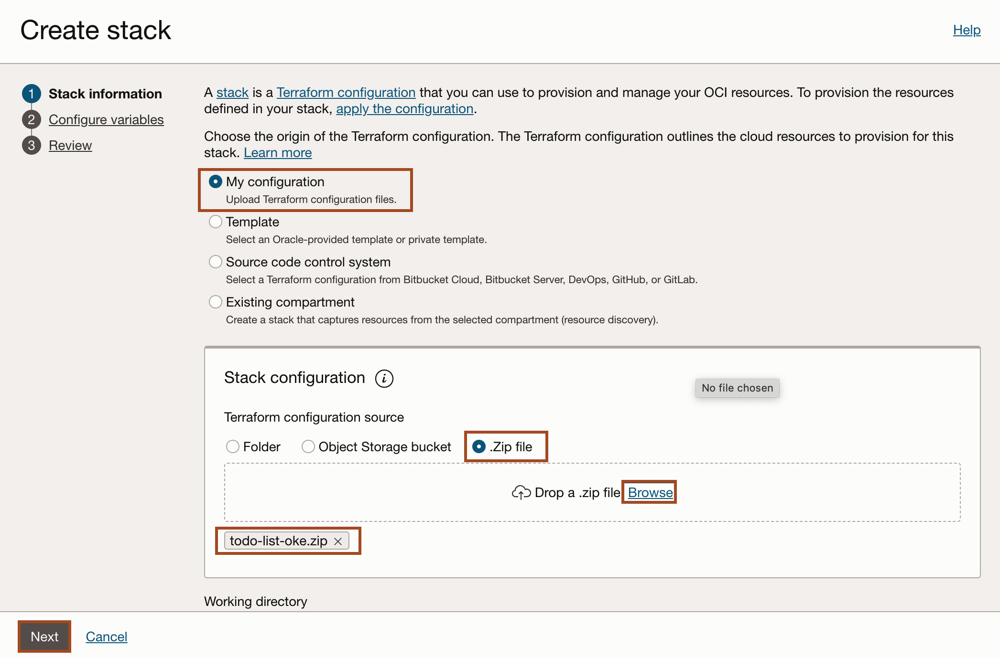

4. Enter **todo-list-oke** as cluster_name and  click **Next**.
    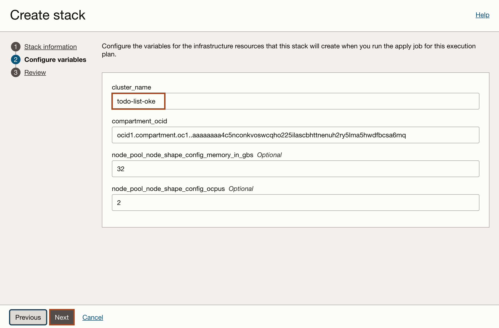
   

7. Select **Run Apply** and click **Create**.
    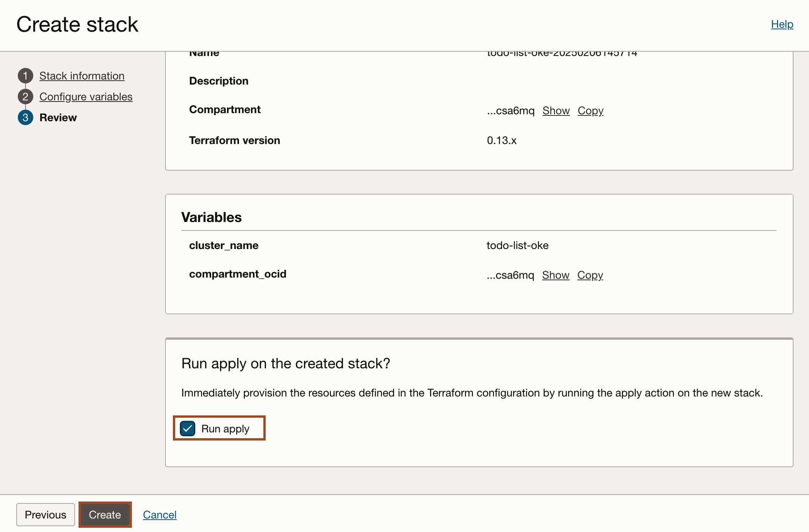

## Task 3: Create Oracle Container Image Registry

1. In the Console, select the **Hamburger Menu** -> **Developer Services** -> **Container Registry** as shown.
    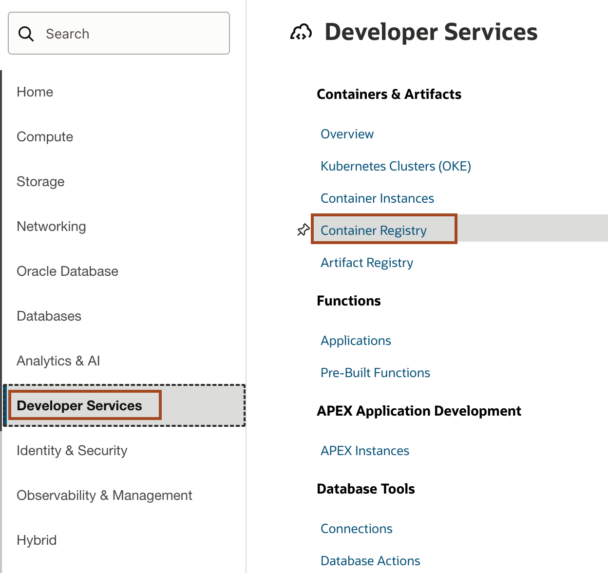

2. Select your compartment, where you are allowed to create the repository. Click **Create repository**.
    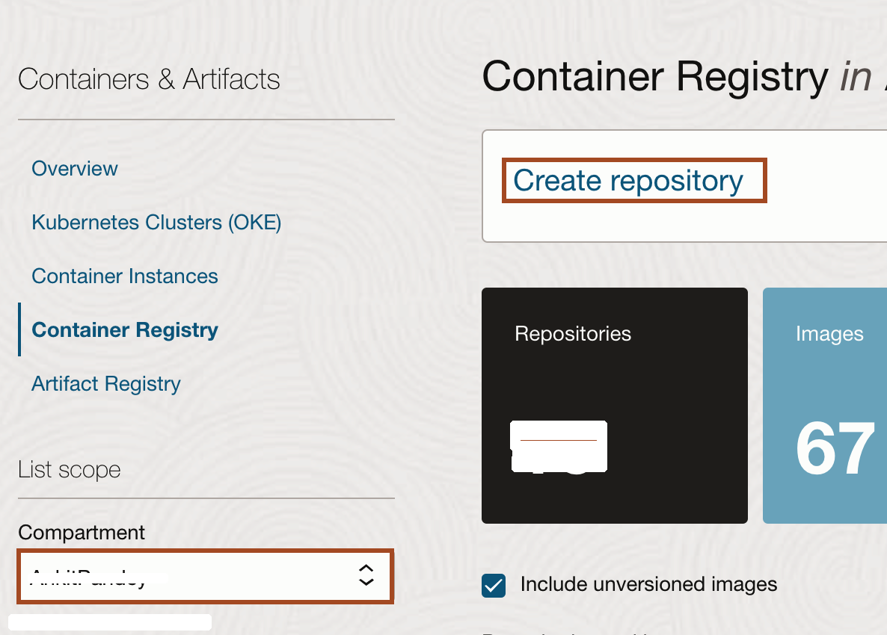

3. Enter **`todo-list-your_firstname`** as Repository name and Access as **Public** then click **Create**.
    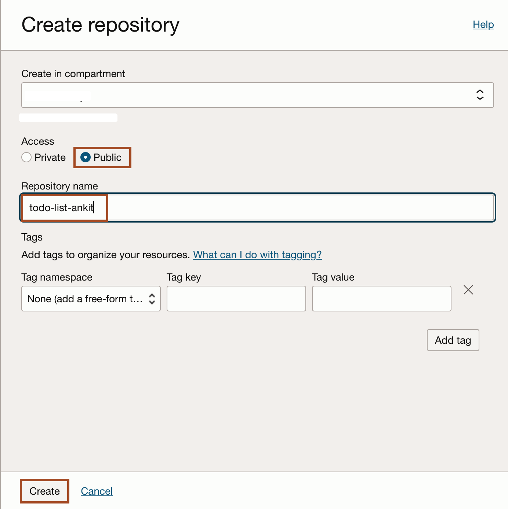

4. Once your repository is ready. Please note down the tenancy namespace in your text file inside the text file.
    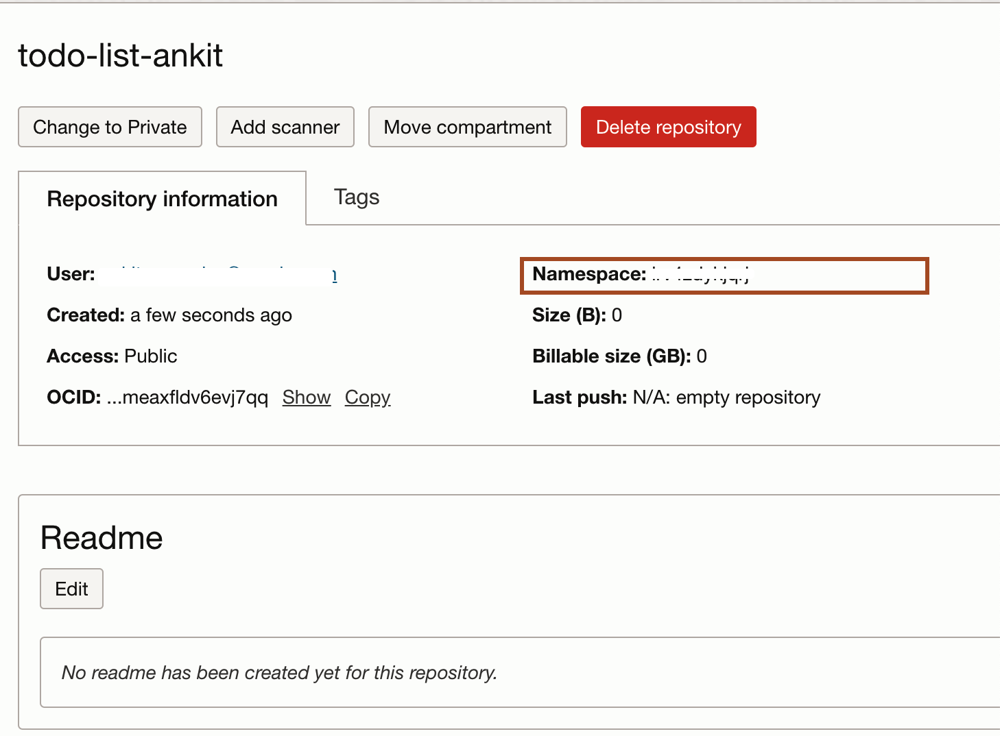

## Task 4: Generate an authentication token

1. Select the User Icon in the top right corner and then select **User settings**.

    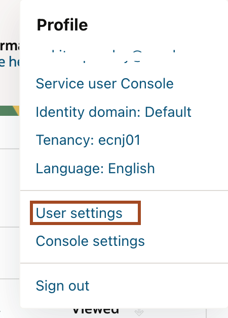

2. Scroll down and select **Auth Tokens** and then click **Generate Token**.

    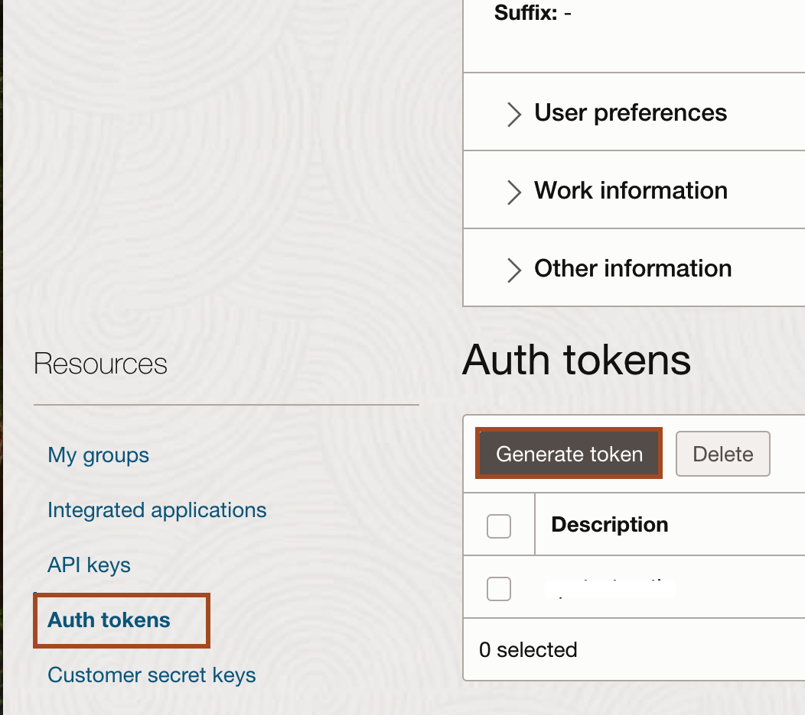

3. Copy **`todo-list-your_first_name`** and paste it in the **Description** box and click **Generate Token**.

    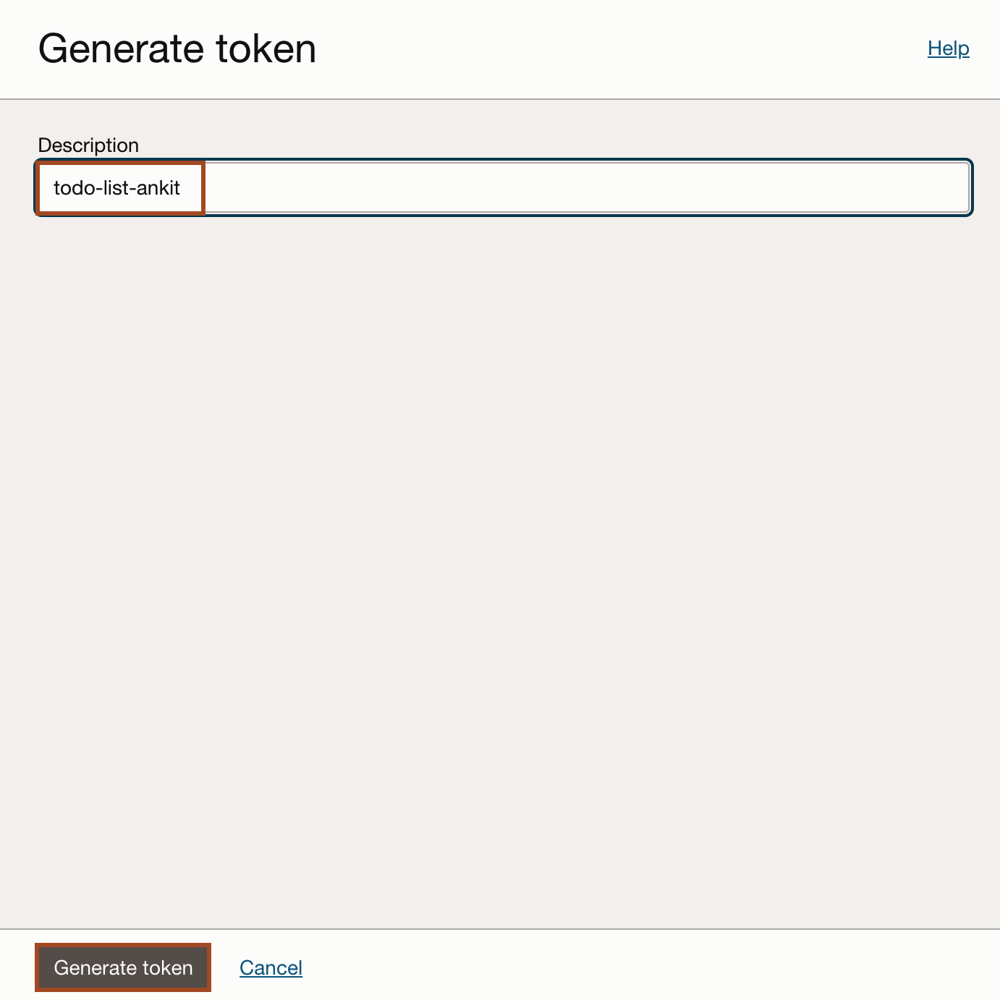

4. Select **Copy** under Generated Token and paste it in your text file. We cannot copy it later. Click **Close**.

    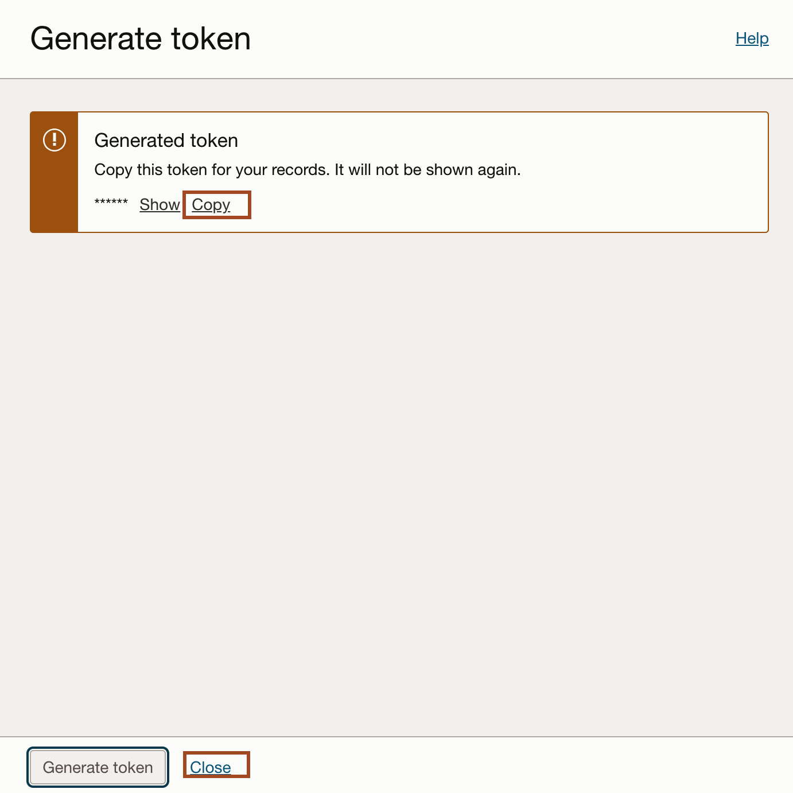

You may now proceed to the next lab.

* **Author** -  Ankit Pandey
* **Contributors** - Maciej Gruszka, Sid Joshi
* **Last Updated By/Date** - Ankit Pandey, February 2025
